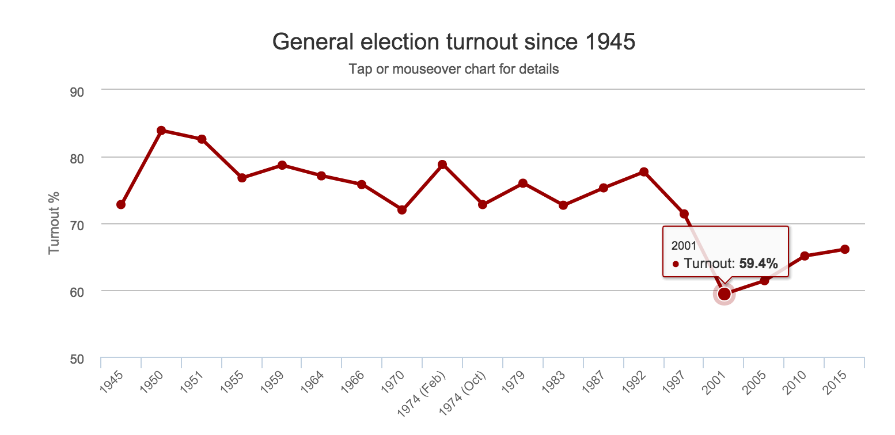

Corbyn needs swingers
=====================


```{r, setup_chunk,echo=FALSE }
#setwd('/Users/rob/Sites/RandomLifeData/Research/Labours-needed-swing/')

tab <-read.csv("election2015-BBC+Pov+Emp.csv")

targets<-subset(tab,Party2015!="Lab")

target_votes<-data.frame(ukip=targets$ukip_vote,libdem=targets$libdem_vote,labour=targets$labour_vote,snp=targets$snp_vote,conservative=targets$conservative_vote, green=targets$green_vote)

target_votes[is.na(target_votes)]<-0

swing=function(df,perc,p1,p2){
  
  #takes data frame, percentage, party1 (donor), party2(receiver)
  tmp_df<-df
  tmp_df[is.na(tmp_df)]<-0
  for (i in seq(1,nrow(df))){
    diff<-floor((df[,p1][i]/100)*perc)
    if (!is.na(diff)){
      #NB: this is not allowing a party to be 'wiped out' in a constituency. This may cause abherrations when perc is large but those scenarios are unlikely
      tmp_df[,p2][i]<-tmp_df[,p2][i]+diff
      tmp_df[,p1][i]<-tmp_df[,p1][i]-diff
    }
  }
  
  return(tmp_df)
  
}

#e.g. tmp_df<-swing(target_votes,5,'snp','labour')

new_seats=function(df,p){
  #takes a data frame and a column header (for the party to investigate for increased/decreased seats)
  df[is.na(df)]<-0
  ind<-which(colnames(df)==p)
  maxes<-max.col(df)
  return(sum(maxes==ind))
  
}
  
#e.g. increase<-new_seats(tmp_df,'labour')
#e.g. increase<-new_seats(swing(target_votes,5,'snp','labour'),'labour')

```
Jeremy Corbyn has recently been elected as leader of the Labour Party and several <a href="http://www.independent.co.uk/voices/comment/jeremy-corbyn-becomes-labour-leader-today-is-our-darkest-hour--we-have-become-unelectable-10497770.html">people are dismayed.</a> The reasoning is quite simple- Jeremy may be popular amongst the left but the left doesn't win elections. Historically, <a href="https://en.wikipedia.org/wiki/List_of_United_Kingdom_general_elections">the Labour Party wins less elections that the Conservatives.</a> In the memory of many Labour supporters is the 80s when we suffered a decade of Thatcher while the <a href="http://www.alastaircampbell.org/blog/2015/08/10/nice-guy-good-mp-making-the-weather-but-it-has-to-be-abc-anyone-but-corbyn-labour-is-finished-if-he-wins/">Labour party had hugely popular leaders like Michael Foot</a>: who had standing room only in all of his public appearances, just like Jeremy Corbyn, but couldn't get elected. Those Labour supporters would say that it was only the centrist policies of John Smith and then Tony Blair that managed to get the Labour Party into power and from there they could introduce a minimum wage, reduce child and pensioner poverty and increase access to education.

From what I can tell Labour had 2 options: try to win votes from centre-ground Tories and give up on Scotland, all the votes they lost to UKIP and continue to ignore the disenfranchised non-voters; or they can move focus away from the centre-ground and try to win back votes from the SNP, UKIP and encourage people to vote... 

From a campaigns perspective, it's far easier to target one group than 3! So straight away it would be more difficult to take that second road the way Corbyn seems to be doing.

Swinging conservatives
======================

I've <a href="https://github.com/randomlifedata/Election-2015-BBC-scraper">scraped all the election data from the BBC website.</a> If we re-run the 2015 election, Labour could get one more seat than the Tories if they got a 12% swing from the Tories. 

```{r tory_swing_chunk, fig.width=7,fig.height=6, echo=FALSE}
#target_stats<-data.frame(max=apply(target_votes,1,max,na.rm=TRUE),sum=apply(target_votes,1,sum,rm.na=TRUE))

target_votes<-data.frame(ukip=targets$ukip_vote,libdem=targets$libdem_vote,labour=targets$labour_vote,snp=targets$snp_vote,conservative=targets$conservative_vote, green=targets$green_vote)

target_votes[is.na(target_votes)]<-0

plot_df<-data.frame(Swing=0,Labour=232,Conservative=330)
for (i in seq(1,100)){
   tmp_df<-swing(target_votes,i,'conservative','labour')
   ns<-new_seats(tmp_df,'labour')
   labs<-232+ns
   cons<-new_seats(tmp_df,'conservative')
   ls<-330-cons
   plot_df<-rbind(plot_df,data.frame(Swing=i,Labour=labs,Conservative=cons))
   if (ns>=50 & ls>=50){
       
       required<-i
       break()
   }
}

bp<-barplot(t(as.matrix(plot_df[,c("Labour","Conservative")])),beside=TRUE,col=c("#d50000","#0087dc"),ylab = "Seats", xlab="Swing from Tory to Labour (%)", axes=FALSE, names.arg=0:i)
axis(2)
legend("bottomleft",c("Labour","Conservative"),fill=c("#d50000","#0087dc"))
title("Needed swing from \nConservative to Labour in 2020")


```
Radical swingers
================
If they want to tackle the other groups, they would need a 43% swing from all of UKIP, SNP and Green - which does see like a tall order:

```{r ukip_snp_green_swing_chunk, fig.width=7,fig.height=6, echo=FALSE}
plot_df<-data.frame(Swing=0,Labour=232,Conservative=330)
for (i in seq(1,100)){
   tmp_df1<-swing(target_votes,i,'ukip','labour')
   tmp_df2<-swing(tmp_df1,i,'snp','labour')
   tmp_df3<-swing(tmp_df2,i,'green','labour')
   ns<-new_seats(tmp_df3,'labour')
   labs<-232+ns
   cons<-new_seats(tmp_df3,'conservative')
   ls<-330-cons
   plot_df<-rbind(plot_df,data.frame(Swing=i,Labour=labs,Conservative=cons))
   if (labs > cons){
       
       required<-i
       break()
   }
}

barplot(t(as.matrix(plot_df[,c("Labour","Conservative")])),beside=TRUE,col=c("#d50000","#0087dc"),ylab = "Seats", xlab="Swing from UKIP&SNP&Green to Labour (%)",axes=FALSE, names.arg=0:i)
axis(2)
legend("bottomleft",c("Labour","Conservative"),fill=c("#d50000","#0087dc"))
title("Needed combined/equal swing \nfrom UKIP & SNP & Green \nto Labour in 2020")
```
The reticent swingers
=====================
The other option is to tap into the 34% of people that don't vote. Adding them as another party that Corbyn needs to 'swing', Labour would need 15% swing from each of UKIP, SNP, Green and non-voters. In numbers, that's pretty close to the 12% needed from the centre ground, but it's a tougher problem as I said earlier. 

```{r ukip_etc_non_voters_swing_chunk, fig.width=7,fig.height=6, echo=FALSE}

target_votes$novote<-floor(as.numeric(gsub(",","",targets$Elector))-(as.numeric(gsub(",","",targets$Elector))/100)*targets$turnout)

plot_df<-data.frame(Swing=0,Labour=232,Conservative=330)
for (i in seq(1,100)){
   tmp_df1<-swing(target_votes,i,'ukip','labour')
   tmp_df2<-swing(tmp_df1,i,'snp','labour')
   tmp_df3<-swing(tmp_df2,i,'green','labour')
   tmp_df4<-swing(tmp_df3,i,'novote','labour')
   ns<-new_seats(tmp_df4[,-7],'labour')
   labs<-232+ns
   cons<-new_seats(tmp_df4[,-7],'conservative')
   ls<-330-cons
   plot_df<-rbind(plot_df,data.frame(Swing=i,Labour=labs,Conservative=cons))
   if (labs > cons){
       
       required<-i
       break()
   }
}

barplot(t(as.matrix(plot_df[,c("Labour","Conservative")])),beside=TRUE,col=c("#d50000","#0087dc"),ylab = "Seats", xlab="Swing from UKIP&SNP&Green&non-voters to Labour (%)",axes=FALSE, names.arg=0:i)
axis(2)
legend("bottomleft",c("Labour","Conservative"),fill=c("#d50000","#0087dc"))
title("Needed combined/equal swing \nfrom UKIP & SNP & Green & non-voters\nto Labour in 2020")

```

Jeremy's choice
===============
Jeremy Corbyn seems to be going for the latter option - and as I've said a couple of times, it's automatically a lot harder to appeal to 4 groups than it is to appeal to 1. It's also really, really tricky to get non-voters to actually turn up on the day so banking on a re-engagement of grassroots people is going to be a struggle.

So for the record, I admit, it's possible that this would all be a lot easier if Labour had chosen Burnham or Cooper who would have targeted the single, central group.

Looking to the positive
=======================
Given the data and the situation, Labour supporters need to start getting behind the idea of appealing to a broad range of groups and thinking that in terms of numbers it's not any different to swinging the Conservative voters. 

There are consistent messages that can appeal to all the protest/disenfranchised/nationalist groups: radical change from the current 'political elite'; strong concern for the funding and maintenance of public services (UKIP voters are concerned about immigration often because of strain on public services); and an anti-war stance that still claims to honour our troops (appealing to the non-voters who I suspect are anti-war, while also appealing to the pro-UK Defence Forces attitude common to UKIP, and perhaps also Scotland that also has strong links to our armed forces).

Growing the grass roots
=======================
What I said earlier about relying on non-voters to turn up is a valid concern, I think - but there are a couple of things that we can get behind given that Corbyn is looking to do just that.

1) For all the main parties to only care about a few middle-ground voters is what data science calls 'falling into a local minimum'. This means it's a solution that looks good but isn't the best possible. If Labour is the voice of the common worker and if any of that one-nation rhetoric from Ed Miliband was truly meant, then Labour has a moral duty to engage with the 34% of people that don't feel represented or like they have a stake in society enough to vote. I realise that's difficult to swallow when there is also the moral argument that you need to get into power to stop the immoral Tory ideology, I'm just saying re-engagement ought to be part of Labour's strategy somewhere - this applies to SNP and UKIP voters too.



2) The needed swing from non-voters is around 15% which sounds like quite a lot but that's 15% of 34% so we only are talking about an increase in voter turnout of 5%. Now I'm not saying that's going to be easy but we only need to go back to the the start of Tony Blair's reign in 1997 and Britain did have voter turnout at the 70% needed. That level of voting is the norm - you could say that it was only in the aftermath of Thatcher and the light of New Labour that people became as disenfranchised as they are now. People keep saying Jeremy is a throwback - that works in his favour for motivating voters!

3) Now may be the perfect time for building a grassroots movement of practiced, registered voters. First, Labour has the Welsh and Scottish elections to test itself on and to get some momentum going - any improvement would be seen as success and things can ONLY get better in Scotland. Next, there is the EU referendum and I guarantee that's going to get people out to vote. If Labour can be engaging those people and coming across as interested in what people have to say, even if they have different opinions about the EU - by 2020, the UK is likely to have a whole bunch of engaged and newly registered voters that think Labour is at least listening to them.

Last word
=========
Don't get me wrong, the smart, politically savvy thing to have done would have been to aim for the middle ground and steal votes from the Tories. Anyone that could <a href="http://www.independent.co.uk/news/uk/politics/ed-miliband-fails-to-look-normal-while-eating-bacon-sandwich-ahead-of-whistlestop-campaign-tour-9409301.html">eat a bacon sandwich properly</a> would have had a good chance of doing that. But, given that Labour is trying to <a href="http://www.moviequotedb.com/movies/braveheart/quote_4304.html">unite the clans</a> and reengage the disenfranchised, I think Labour supporters of all stripes ought to be able to see that there is potential, especially at this time, and that the numbers game is not so different this way (15% swing) as it would have been in the centre ground (12% swing).

Supporting info
===============
The code and data for this blog can be found on GitHub
<a href="https://github.com/randomlifedata/Blog-Corbyn-needs-swingers">Code for "Corbyn needs swingers" and scraped BBC election results (.CSV)</a>
<a href="https://github.com/randomlifedata/Election-2015-BBC-scraper">Code for scraping BBC election results 2015 </a>